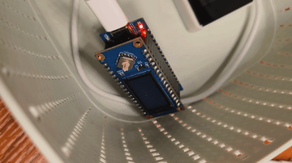

# Examples for the BSP `espressif-esp`

- [Blinky](src/blinky.zig) 
Showcases how to do a simple blink using microzig 0.12.1(zig 0.13.0).
The two leds are connected to gpio12 and gpio13.

## steps
```sh
cd /Users/workspace/Desktop/projects/ByeIO/software/exp48-esp32c3-microzig-blink/microzig-0.12.1/examples/espressif/esp
# JUST BUILD
zig build
# 烧录/flash
esptool.py --chip auto --port /dev/cu.wchusbserial56910187941 -b 460800 --before=default_reset --after=hard_reset write_flash --flash_mode dio --flash_freq 80m 0x0 /Users/workspace/Desktop/projects/ByeIO/software/exp48-esp32c3-microzig-blink/microzig-0.12.1/examples/espressif/esp/zig-out/firmware/esp32-c3_blinky.bin --force
```
输出/output:
```sh
install
└─ install generated to esp32-c3_blinky.elf
   └─ zig build-exe esp32-c3_blinky Debug riscv32-freestanding-eabi
      └─ run regz (chip.zig) stderr
warning(svd): failed to load register: error.TodoDimElementsExtended
warning(svd): failed to load register: error.TodoDimElementsExtended
warning(svd): failed to load register: error.TodoDimElementsExtended
warning(svd): failed to load register: error.TodoDimElementsExtended
warning(svd): failed to load register: error.TodoDimElementsExtended
warning(svd): failed to load register: error.TodoDimElementsExtended
warning(svd): failed to load register: error.TodoDimElementsExtended
warning(svd): failed to load register: error.TodoDimElementsExtended
warning(svd): failed to load register: error.TodoDimElementsExtended
warning(svd): failed to load register: error.TodoDimElementsExtended
warning(svd): failed to load register: error.TodoDimElementsExtended
warning(svd): failed to load register: error.TodoDimElementsExtended
warning(svd): failed to load register: error.TodoDimElementsExtended
warning(svd): failed to load register: error.TodoDimElementsExtended
warning(svd): failed to load register: error.TodoDimElementsExtended
warning(svd): failed to load register: error.TodoDimElementsExtended
warning(svd): failed to load register: error.TodoDimElementsExtended
warning(svd): failed to load register: error.TodoDimElementsExtended
warning(svd): failed to load register: error.TodoDimElementsExtended
warning(svd): failed to load register: error.TodoDimElementsExtended
warning(svd): failed to load register: error.TodoDimElementsExtended
warning(svd): failed to load register: error.TodoDimElementsExtended
warning(svd): failed to load register: error.TodoDimElementsExtended
warning(svd): failed to load register: error.TodoDimElementsExtended
warning(svd): failed to load register: error.TodoDimElementsExtended
warning(svd): failed to load register: error.TodoDimElementsExtended
warning(svd): failed to load register: error.TodoDimElementsExtended
warning(svd): failed to load register: error.TodoDimElementsExtended
```
It's fine.

## result
|blink|
|-----|
||